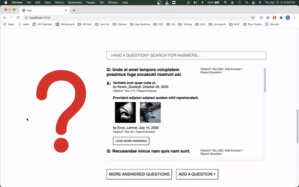

# Reviews
A reviews component widget \
*by*\
[Agustin Feliciano](https://github.com/gusfel)
---
This is the reviews widget of an online retailer's product page.  It pulls from a database using a RESTful API and renders using React and Webpack.

**Technologies Used**
1. React
2. NodeJS
3. ExpressJS
4. CSS
5. HTML
6. Webpack

**Setup**
1. cd thirdTimesACharm/
2. Run npm install
3. Run npm run webpack
4. Run npm start
5. Open localhost:3000

\* The page will render, but it wont have any product data because you need an api key to access the database so please see below for a gif of the functionality

